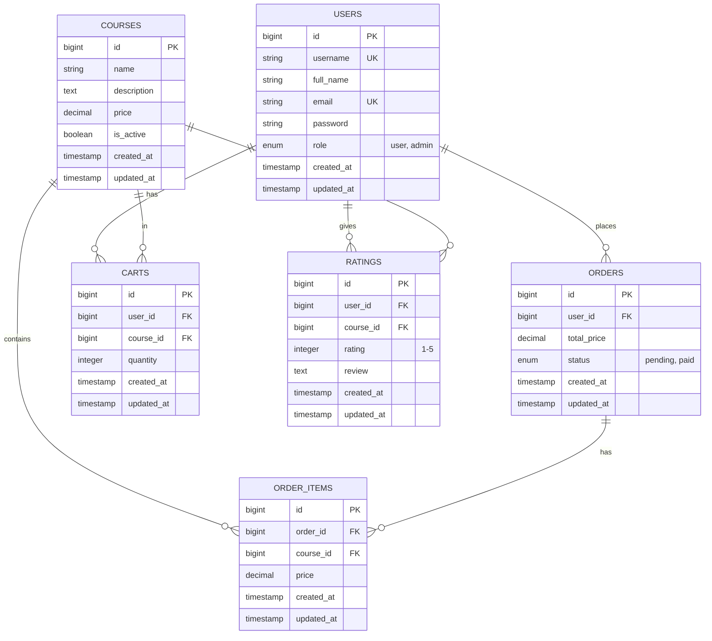
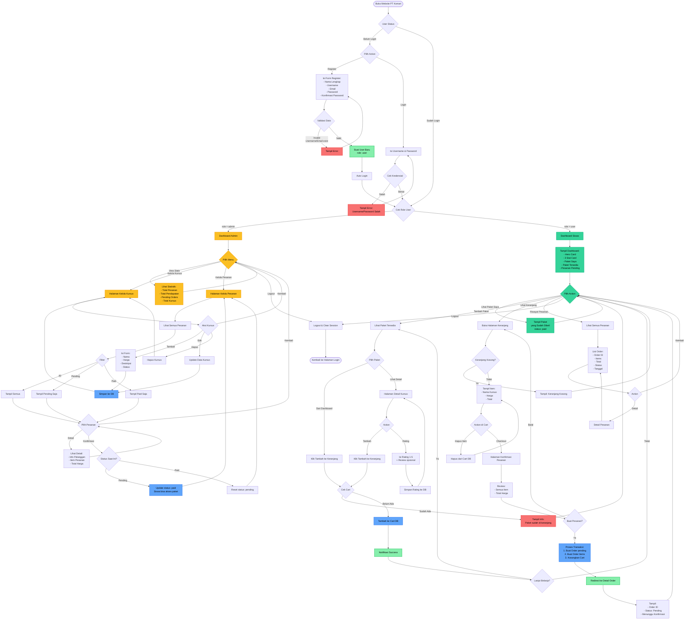
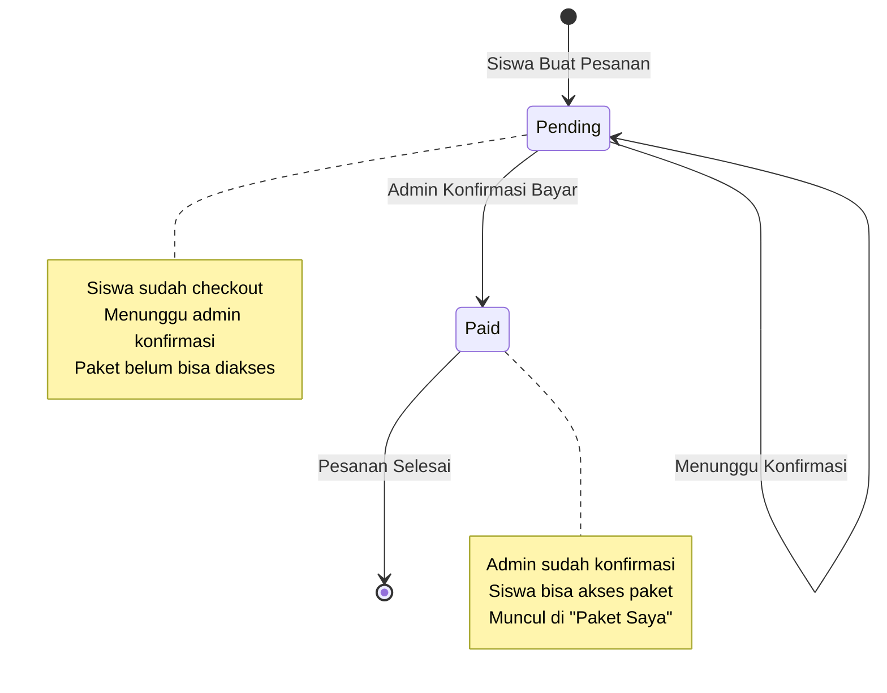
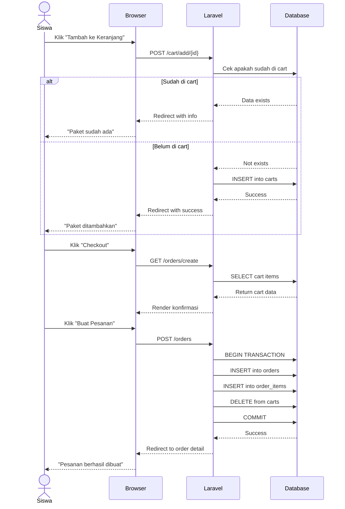
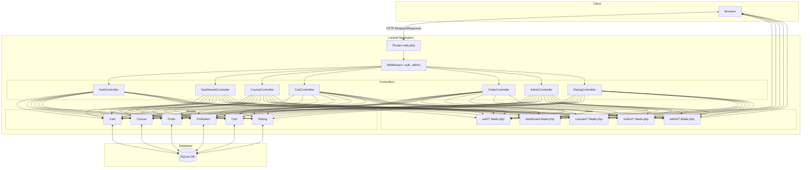
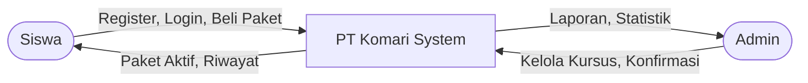
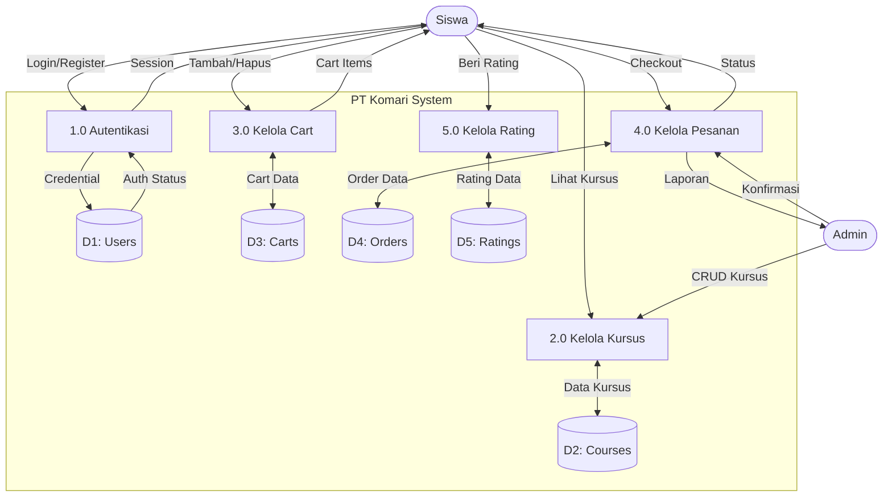

# 📊 FLOWCHART & ERD - PT KOMARI

## 🗄️ ERD (Entity Relationship Diagram)

---

## 🔄 FLOWCHART LENGKAP - SEMUA PROSES

**Keterangan Warna:**
- 🟡 **Kuning**: Proses Admin
- 🟢 **Hijau**: Proses Siswa
- 🔵 **Biru**: Proses Transaksi/Database
- 🔴 **Merah**: Error/Warning
- 🟩 **Hijau Muda**: Success/Berhasil

---

## 🎯 USE CASE DIAGRAM

```mermaid
graph TB
    subgraph Siswa
        S1[Register Akun]
        S2[Login]
        S3[Lihat Kursus]
        S4[Tambah ke Keranjang]
        S5[Checkout]
        S6[Lihat Riwayat Pesanan]
        S7[Beri Rating Kursus]
    end
    
    subgraph Admin
        A1[Login Admin]
        A2[Lihat Dashboard Stats]
        A3[Kelola Kursus]
        A4[Tambah Kursus]
        A5[Edit Kursus]
        A6[Hapus Kursus]
        A7[Kelola Pesanan]
        A8[Konfirmasi Pembayaran]
    end
    
    SISWA((Siswa)) --> S1
    SISWA --> S2
    SISWA --> S3
    SISWA --> S4
    SISWA --> S5
    SISWA --> S6
    SISWA --> S7
    
    ADMIN((Admin)) --> A1
    ADMIN --> A2
    ADMIN --> A3
    ADMIN --> A4
    ADMIN --> A5
    ADMIN --> A6
    ADMIN --> A7
    ADMIN --> A8
```

---

## 📋 STATE DIAGRAM - Order Status

---

## 🔐 SEQUENCE DIAGRAM - Proses Checkout

---

## 🏗️ ARCHITECTURE DIAGRAM

---

## 📊 DATA FLOW DIAGRAM - Level 0 (Context)

---

## 📊 DATA FLOW DIAGRAM - Level 1

---

## 🔢 BUSINESS RULES

### User Registration
- Username harus unique
- Email harus unique & valid format
- Password minimum 6 karakter
- Password confirmation harus sama
- Default role: `user`

### Cart Management
- Satu user bisa punya banyak item di cart
- Satu course tidak bisa ditambah 2x ke cart yang sama
- Cart otomatis kosong setelah checkout

### Order Processing
- Order dibuat dengan status `pending`
- Total price dihitung dari sum semua course price
- Order items menyimpan snapshot harga saat checkout
- Status order: `pending` atau `paid`

### Admin Authorization
- Hanya user dengan role `admin` yang bisa akses `/admin/*`
- Admin bisa mengubah status order
- Admin bisa CRUD courses

### Course Availability
- Hanya course dengan `is_active = true` yang tampil untuk siswa
- Course yang sudah dibeli (status paid) muncul di "Paket Saya"
- Course bisa di-rate oleh siswa

---

## 📝 GLOSSARY

| Term | Definisi |
|------|----------|
| **Siswa** | User dengan role `user` yang bisa membeli paket kursus |
| **Admin** | User dengan role `admin` yang mengelola sistem |
| **Course** | Paket kursus/pembelajaran yang dijual |
| **Cart** | Keranjang belanja temporary sebelum checkout |
| **Order** | Pesanan yang sudah dibuat siswa |
| **Order Item** | Item individual dalam satu order |
| **Pending** | Status pesanan yang menunggu konfirmasi admin |
| **Paid** | Status pesanan yang sudah dikonfirmasi/lunas |
| **Rating** | Penilaian & review dari siswa untuk course |

---

**Dibuat dengan Mermaid Diagram** 📊
Dokumentasi ini dapat di-render di GitHub, GitLab, atau VS Code dengan extension Mermaid.
